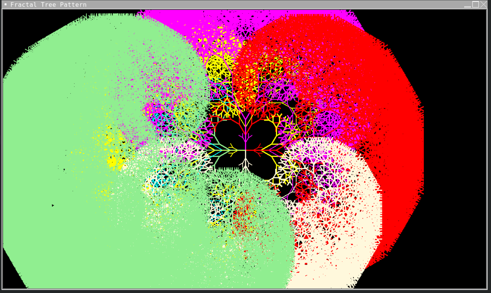

# FractalTree 

Draws fractal trees in 4 90 degree angles endlessly in selected colors

For a school project.

## Screenshots

## Credits

My friend, who doesn't have a GitHub account for creating the original code and idea

[@teppyboy](https://github.com/teppyboy) - for helping me refactor the code and expanding it to further potential. 
